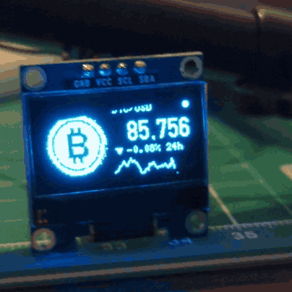
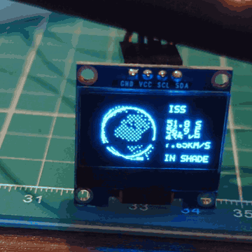

# uno-oled-live

Live-data animations on an Arduino Uno with a 0.96" SSD1306 OLED (128×64). The Uno has no network, so a small Python script on the laptop fetches the data and sends it over USB.

| BTC ticker | ISS tracker |
|---|---|
|  |  |
| Spinning 3D coin, live price with rolling digits, 24 h change and chart. Data: Coinbase. | Spinning globe lit by the real sun, the ISS on its orbit ring, position, altitude and speed. Data: wheretheiss.at. |

## Wiring

| OLED | Uno |
|---|---|
| GND | GND |
| VCC | 5V |
| SDA | D4 |
| SCL | D5 |

D4/D5 aren't the Uno's hardware I2C pins, so the sketches bit-bang I2C themselves.

## Setup

```sh
arduino-cli core install arduino:avr
python -m venv .venv && .venv/bin/pip install -r requirements.txt
```

## Run

```sh
arduino-cli compile -b arduino:avr:uno --output-dir build/iss iss
arduino-cli upload -b arduino:avr:uno -p /dev/ttyUSB0 --input-dir build/iss iss
.venv/bin/python iss/feed.py            # keep running; same for btc
```

## Simulate

With [wokwi-cli](https://docs.wokwi.com/wokwi-ci/cli-installation) and `WOKWI_CLI_TOKEN` set:

```sh
./sim.sh iss --screenshot-part oled --screenshot-time 2500 --screenshot-file build/shot.png
```

## Layout

- `btc/`, `iss/`: one folder per animation: the sketch, its `feed.py`, and `gen_*.py`, which regenerates the `.h` data (coin frames, globe lookup tables).
- `hello/`: first wiring test.
- `diagnostics/`: `i2c_check` (is the display found?), `rise_test` (are the I2C lines healthy?), `oled_raw` (light every pixel).

If the screen stays dark or glitches, check the VCC/GND joints first: a loose VCC caused every display problem so far.
